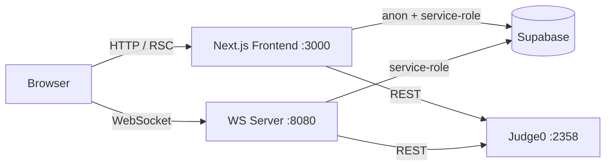

# DSA Battle — Documentation

DSA Battle is a real-time 1-v-1 competitive programming platform: two players are
matched by rating, receive the same DSA problem, and race to be the first to pass
all test cases. Winning updates ELO ratings. A practice mode lets users solve
problems solo against the same judge.

> All documentation in this folder is derived from the actual implementation.
> Where behavior is unclear or assumed, it is explicitly marked **Assumption**.

## High-level architecture

Two independently-run processes plus two external services:

| Piece | Location | Role |
|---|---|---|
| **Next.js app** | [`Frontend/`](../Frontend) | UI, auth, problem browsing, practice judging (`/api/execute`, `/api/submit`) |
| **WebSocket server** | [`server/`](../server) | Matchmaking queue, battle rooms, battle judging, ELO finalization (port 8080) |
| **Supabase** | external | Postgres database + authentication (email, Google, GitHub) |
| **Judge0** | external | Sandboxed code execution (local Docker or remote VM) |



The browser **never** talks to Judge0 or uses the service-role Supabase key —
all judging goes through the Next.js API routes (practice) or the WS server
(battles).

## Tech stack

- **Frontend:** Next.js 16 (App Router, Turbopack), React 19, TypeScript, Tailwind CSS v4, shadcn/ui (Radix), Monaco Editor, next-themes (dark/light)
- **Backend:** Node.js + `ws` (standalone WebSocket server, TypeScript, run with `tsx`)
- **Data/Auth:** Supabase (Postgres + Auth via `@supabase/ssr`)
- **Judging:** Judge0 CE (Python 3.8 / Java / C++), driven via its REST API
- **Content tooling:** TypeScript scripts (discover → generate → validate → seed) over a LeetCode-style dataset

## Main features

- Email/Google/GitHub auth with onboarding (username + starting rating 1000)
- Problem list + detail pages with Monaco editor, run-with-custom-stdin, and full judged submissions
- Rating-range matchmaking (each player sets a ±range; both must mutually match)
- Live battle rooms: shared problem, opponent status, first-ACCEPTED-wins
- ELO rating updates (K=32) + per-battle rating history
- Dashboard with stats, leaderboard preview, recent battles
- Animated "Living Graph" landing-page background (Canvas 2D)

## Folder structure (top level)

```
DSABattle/
├── CLAUDE.md              # Agent/contributor context — key architecture rules
├── docs/                  # ← you are here
├── Frontend/              # Next.js app (see frontend/folder-structure.md)
├── server/                # WebSocket server (see backend/folder-structure.md)
└── local-explanation/     # Historical code-review notes (June 2026; partially stale)
```

## Quick start

Prerequisites: Node 20+, a Supabase project, and a Judge0 instance
(local Docker at `http://localhost:2358` is the default fallback).

```powershell
# 1. Configure env (see environment.md)
#    Frontend/.env.local  and  server/.env

# 2. Terminal 1 — WebSocket server (port 8080)
cd server; npm install; npm run dev

# 3. Terminal 2 — Frontend (port 3000)
cd Frontend; npm install; npm run dev
```

Seed problems (15 already exist in `Frontend/data/problems/`):

```powershell
cd Frontend; npm run seed:problems
```

Full setup details: [development-guide.md](development-guide.md).

## Documentation index

### Core
- [architecture.md](architecture.md) — system architecture, data flow, request/battle lifecycles, design decisions

### Frontend
- [frontend/overview.md](frontend/overview.md) — framework architecture and patterns
- [frontend/routing.md](frontend/routing.md) — App Router pages, layouts, route protection
- [frontend/components.md](frontend/components.md) — component organization, workspace system, Living Graph background
- [frontend/state-management.md](frontend/state-management.md) — server components, hooks, WebSocket state
- [frontend/styling.md](frontend/styling.md) — Tailwind v4 tokens, dark/light theming
- [frontend/api-integration.md](frontend/api-integration.md) — Supabase clients, API routes, WS client
- [frontend/folder-structure.md](frontend/folder-structure.md)

### Backend
- [backend/overview.md](backend/overview.md) — WS server architecture and lifecycle
- [backend/api.md](backend/api.md) — REST endpoints + full WebSocket message protocol
- [backend/database.md](backend/database.md) — schema, ER diagram, relationships, RLS notes
- [backend/authentication.md](backend/authentication.md) — Supabase auth flows, middleware, onboarding
- [backend/services.md](backend/services.md) — matchmaking, battle, judging, connection services
- [backend/folder-structure.md](backend/folder-structure.md)

### Operations
- [environment.md](environment.md) — every environment variable, both processes
- [development-guide.md](development-guide.md) — local setup, scripts, workflow
- [deployment.md](deployment.md) — production topology, builds, scaling caveats
- [content-pipeline.md](content-pipeline.md) — problem discovery/generation/validation/seeding

### Quality
- [security.md](security.md) — auth/authz model, protections, **known gaps**
- [testing.md](testing.md) — current state (validation scripts) and how to extend
- [troubleshooting.md](troubleshooting.md) — common failures and fixes
- [code-quality.md](code-quality.md) — conventions, patterns, technical debt
- [glossary.md](glossary.md) — domain terms
- [judging-performance.md](judging-performance.md) — why judging is slow and the optimization roadmap

> Note: there is no `backend/middleware.md` — the WS server has no middleware
> layer; Next.js middleware is covered in [backend/authentication.md](backend/authentication.md).
> Backend architecture is folded into [backend/overview.md](backend/overview.md).
