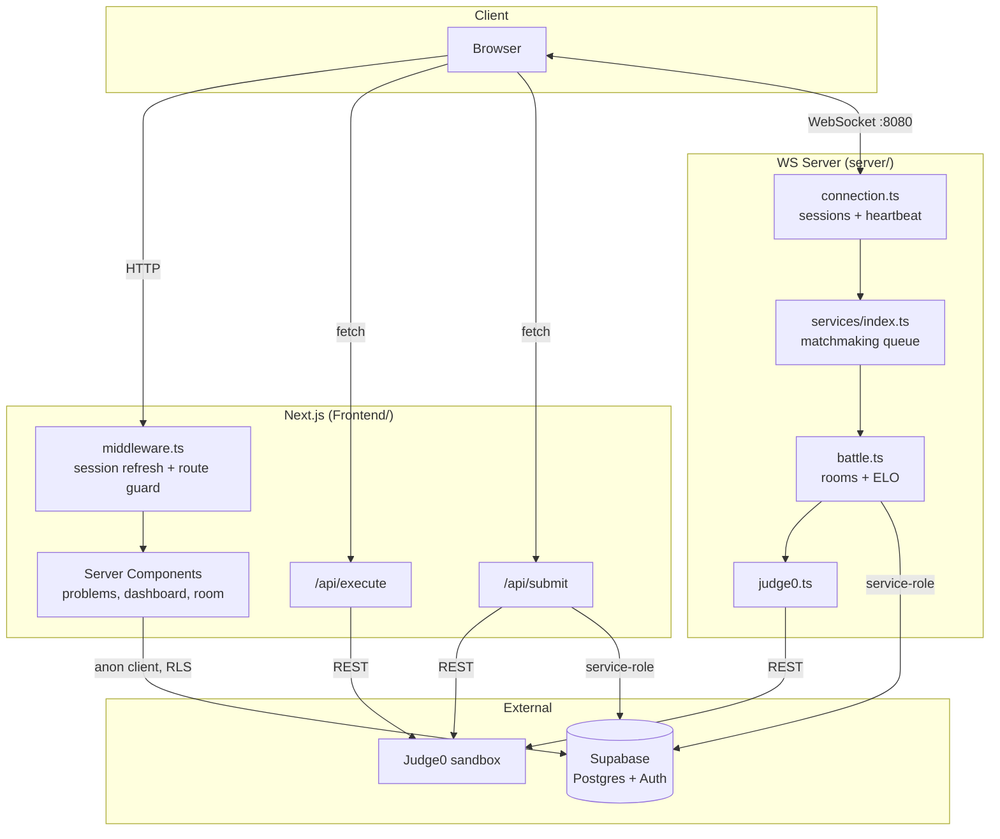
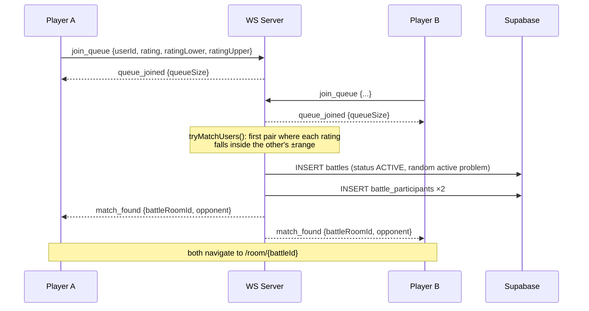
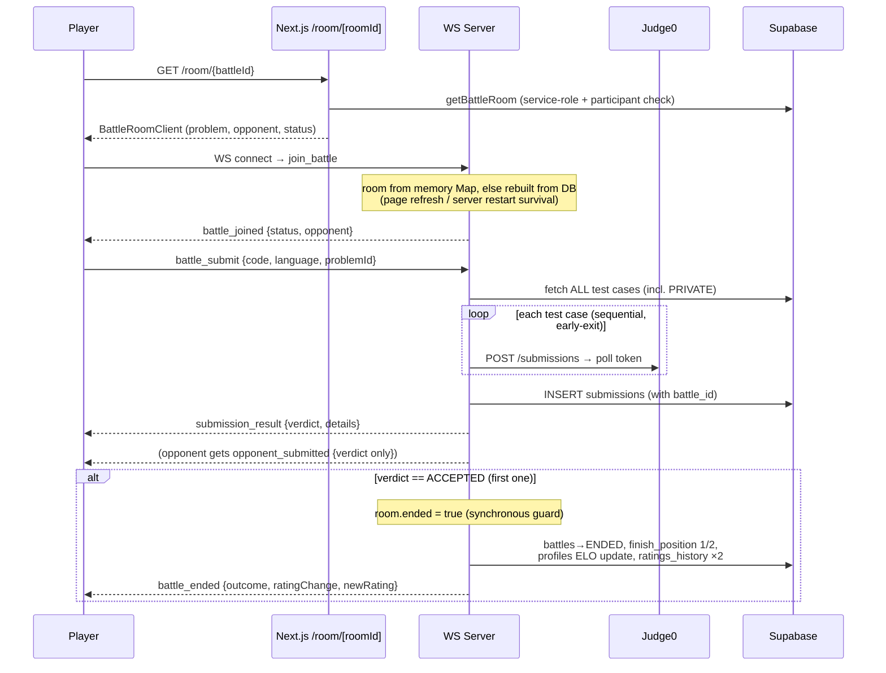

# System Architecture

## Overview

DSA Battle is deliberately split into **two processes** with different jobs:

1. **`Frontend/` — Next.js 16 app.** Everything request/response-shaped: pages,
   auth, problem browsing, and the *practice* judging path (stateless API
   routes, deployable to Vercel).
2. **`server/` — standalone Node WebSocket server.** Everything long-lived and
   stateful: the matchmaking queue, live battle rooms, and the *battle* judging
   path. State lives in memory (`Map`s), with the database as the durable
   source of truth it can rebuild from.

Both talk to the same **Supabase** project and the same **Judge0** instance.

## The two submission paths

This is the most important architectural rule in the codebase
(see [`CLAUDE.md`](../CLAUDE.md)):

| | Practice | Battle |
|---|---|---|
| Entry | `POST /api/submit` (Next.js) | WS message `battle_submit` |
| Judge code | `Frontend/lib/judge0/judgeSubmission.ts` | `server/src/services/judge0.ts` |
| Test cases fetched by | service-role client (`utils/supabase/admin.ts`) | service-role client (`server/src/services/supabase.ts`) |
| Persistence | `submissions` row with `battle_id = null` | `submissions` row with `battle_id` set |
| Side effects | none | first ACCEPTED finalizes the battle: status→ENDED, `finish_position`, ELO, `ratings_history` |

The two judge implementations are intentionally **duplicated and kept in
sync** (identical verdict logic, identical stderr-privacy gating) rather than
shared, because they live in separate packages with separate deploy targets.
See [judging-performance.md](judging-performance.md) for the judging internals
and known latency issues.

**Invariants:**
- The browser never calls Judge0 directly.
- The service-role Supabase client never reaches the browser.
- `PRIVATE` test cases never reach the browser — problem pages only fetch
  `PUBLIC` ones, `/api/submit` returns only the verdict object, and `stderr`
  is surfaced only for PUBLIC test cases or pre-execution (compile) failures.

## Request lifecycle (page load)

1. Browser requests a page.
2. `Frontend/middleware.ts` runs on every non-static request:
   refreshes the Supabase session cookie, redirects unauthenticated users off
   protected routes (`/dashboard`, `/battle`, `/profile`, `/matchmaking`,
   `/room`), forces users without a `profiles` row to `/onboarding`, and
   bounces authenticated users away from `/auth/login`/`/auth/signup`.
3. The page's **server component** fetches data with the cookie-scoped anon
   client (`utils/supabase/server.ts`) — RLS applies — or, for battle rooms,
   with the service-role client plus an explicit participant check
   (`lib/battles/getBattleRoom.ts`).
4. Client components hydrate; interactive flows (matchmaking, battles) open a
   WebSocket to the WS server.

## Matchmaking flow

Matchmaking is **rating-range based and entirely in-memory** on the WS server.
The old `matchmaking_queue` DB table was dropped — do not re-add it.

Compatibility is **mutual**: `b.rating ∈ [a.rating+a.lower, a.rating+a.upper]`
**and** `a.rating ∈ [b.rating+b.lower, b.rating+b.upper]`. Matching runs on
every queue join, scanning in join order (FIFO-biased greedy scan), and
recurses while pairs remain.

## Battle lifecycle

The battle room id **is** the `battles.id` UUID — `/room/[roomId]` routes
directly by battle primary key.

Key resilience property: rooms live in `Map<battleId, BattleRoom>` but are
**rebuilt from the DB on demand** (`rebuildRoomFromDb`) — a page refresh, a new
socket, or a WS-server restart mid-battle does not lose the battle.

## Authentication flow

Supabase Auth with three providers (email+password with confirmation, Google
OAuth, GitHub OAuth). All flows land on `GET /auth/confirm`, which exchanges
the PKCE `code` (or legacy `token_hash`) for a session and redirects to
`/dashboard`. Middleware then routes first-time users (no `profiles` row) to
`/onboarding`, where a server action creates the profile with rating 1000.
Details: [backend/authentication.md](backend/authentication.md).

## Design decisions & trade-offs

| Decision | Why | Trade-off |
|---|---|---|
| Separate WS server instead of Next.js websockets | Vercel/serverless can't hold long-lived sockets or in-memory queues | Two deploy targets; duplicated judge logic |
| In-memory matchmaking + rooms, DB as recovery source | Simple, fast, no queue-table polling | Single-instance only — no horizontal scaling without shared state (see [deployment.md](deployment.md)) |
| Battle id = room id | One less mapping; deep-linkable rooms | Room URLs are guessable UUIDs — access is enforced by participant check, not obscurity |
| Judge logic duplicated FE/WS | Independent deployability | Must be kept in sync manually (documented in both files) |
| No `winner_id` on `battles`; winner = `finish_position = 1` | Scales to >2 players later | Winner lookups need a join on `battle_participants` |
| Test cases stored in machine **and** display formats | Judge0 needs raw stdin/stdout; UI needs human-readable examples | Content pipeline must produce both; never derive one from the other |
| stdout compared with trim + `\r\n`→`\n` normalization only | Simple, language-agnostic | Whitespace-sensitive or float-tolerant problems unsupported |
| ELO K=32, computed in app code | Simple | Rating updates are non-transactional (see [code-quality.md](code-quality.md)) |

## External services

- **Supabase** — Postgres (7 tables, see [backend/database.md](backend/database.md))
  and Auth. Two access levels: browser/SSR anon key (RLS enforced) and
  service-role key (server-only, bypasses RLS).
- **Judge0** — resolved identically in both judge files:
  `AWS_VM_URL` (remote VM) → `JUDGE0_URL` (manual override) →
  `http://localhost:2358` (local Docker fallback). Languages: Python (71),
  Java (62), C++ (54). Limits per run: 2s CPU, 5s wall, 128 MB.
