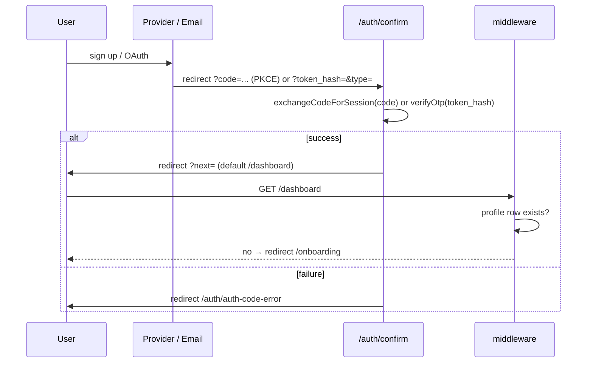

# Authentication & Authorization

Authentication is **entirely Supabase Auth** — the app stores no passwords and
issues no tokens of its own. Sessions are cookie-based via `@supabase/ssr`.

## Providers & flows

Defined in `Frontend/services/auth.service.ts` (used by `hooks/auth/*` and the
auth form components):

| Flow | Mechanism |
|---|---|
| Email + password signup | `supabase.auth.signUp` with `emailRedirectTo: <origin>/auth/confirm` — email confirmation required |
| Email + password login | `signInWithPassword` |
| Google / GitHub | `signInWithOAuth` with `redirectTo: <origin>/auth/confirm` |
| Password reset | forgot-password page → email → `/auth/reset-password` |
| Logout | `signOut` (`LogoutButton`) |

### The confirm endpoint

`GET /auth/confirm` (`app/auth/confirm/route.ts`) terminates every flow:

## Session handling

- **Middleware** (`middleware.ts` + `utils/supabase/middleware.ts#updateSession`)
  refreshes the session on every matched request and returns `{ response,
  user, supabase }` in one pass so route guards reuse the same `getUser()`
  result (no duplicate auth round-trips).
- **Server components / actions** use the cookie-scoped client from
  `utils/supabase/server.ts` and call `supabase.auth.getUser()` directly.
- **Browser** components subscribe to `onAuthStateChange`; the
  `INITIAL_SESSION` event supplies the current user (a parallel `getUser()`
  call is avoided — it raced for the same Web Lock, causing
  "Lock broken by another request"; documented in `components/home/navbar.tsx`).

## Onboarding

Middleware forces any authenticated user **without a `profiles` row** to
`/onboarding`. Its server action (`createProfile`) upserts
`{ id: user.id, username, rating: 1000 }`, mapping Postgres error `23505` to
"username taken", then redirects to `/dashboard`.

Consequence: a `profiles` row is the app's definition of a "complete" account —
every downstream feature (matchmaking, battles, leaderboard) assumes it exists.

## Authorization model

| Resource | Enforced by |
|---|---|
| Protected pages (`/dashboard`, `/matchmaking`, `/room`, `/battle`, `/profile`) | middleware redirect |
| Page data | RLS via the anon cookie client |
| Battle room access | `getBattleRoom()` — service-role read + explicit *is this user a participant* check; non-participants get `notFound()` |
| Private test cases | never selected for browsers; only service-role paths read them |
| Battle submissions | ⚠ the WS server trusts the `userId` in the message payload — there is **no session verification on the WebSocket**. See [../security.md](../security.md) |

## Auth environment

Only the two public Supabase vars are needed for auth
(`NEXT_PUBLIC_SUPABASE_URL`, `NEXT_PUBLIC_SUPABASE_ANON_KEY`); OAuth
providers (Google, GitHub) are configured in the Supabase dashboard, including
allowed redirect URLs — remember to add both `http://localhost:3000/auth/confirm`
and the production origin.
