# Database

Supabase Postgres. **There are no migration files in the repo** — the schema
below is reverse-engineered from [`CLAUDE.md`](../../CLAUDE.md) and the queries
in the code; new environments must create tables by hand (known gap, see
[../code-quality.md](../code-quality.md)).

## ER diagram

```mermaid
erDiagram
    auth_users ||--|| profiles : "id"
    profiles ||--o{ battle_participants : "user_id"
    profiles ||--o{ submissions : "user_id"
    profiles ||--o{ ratings_history : "user_id"
    problems ||--o{ problem_test_cases : "problem_id"
    problems ||--o{ battles : "problem_id"
    problems ||--o{ submissions : "problem_id"
    battles ||--o{ battle_participants : "battle_id"
    battles ||--o{ submissions : "battle_id (nullable)"
    battles ||--o{ ratings_history : "battle_id (nullable)"

    profiles {
        uuid id PK "references auth.users"
        text username UK
        int rating "default 1000"
        int wins
        int losses
        int battles_played
        text avatar_url
        timestamptz created_at
    }
    problems {
        uuid id PK
        text title
        text description
        enum difficulty "EASY|MEDIUM|HARD"
        int time_limit_ms
        int memory_limit_kb
        text slug UK
        bool is_active "default true"
        text_arr categories
        text_arr input_format
        text_arr output_format
        text_arr constraints
    }
    problem_test_cases {
        uuid id PK
        uuid problem_id FK
        text input "machine stdin"
        text expected_output "machine stdout"
        text display_input "human-readable"
        text display_output "human-readable"
        enum visibility "PUBLIC|PRIVATE, default PRIVATE"
        int order_index
    }
    battles {
        uuid id PK "doubles as room id /room/[id]"
        uuid problem_id FK
        enum status "WAITING|COUNTDOWN|ACTIVE|ENDED"
        timestamptz created_at
        timestamptz started_at
        timestamptz ended_at
    }
    battle_participants {
        uuid id PK
        uuid battle_id FK
        uuid user_id FK
        bool is_ready
        int finish_position "NULL=unfinished, 1=winner"
        timestamptz solved_at
    }
    submissions {
        uuid id PK
        uuid battle_id FK "NULL = practice"
        uuid user_id FK
        uuid problem_id FK
        text source_code
        text language "python|java|cpp"
        enum verdict
        int runtime_ms
        int memory_kb
        int passed_testcases
        int total_testcases
        timestamptz created_at
    }
    ratings_history {
        uuid id PK
        uuid user_id FK
        uuid battle_id FK
        int old_rating
        int new_rating
        int rating_change
        timestamptz created_at
    }
```

## Entity notes

### `profiles`
1:1 extension of `auth.users`, created during **onboarding** (not by trigger)
via an upsert in a server action. `username` unique — violation code `23505`
maps to the "username taken" error. Rating starts at 1000; `wins`/`losses`/
`battles_played` are denormalized counters updated by the WS server at battle
finalization.

### `problems`
Seeded by `Frontend/scripts/seed/seedProblems.ts` (upsert by `slug`,
`is_active = true`). Battle problem selection is a uniform random pick over
active problems. `time_limit_ms`/`memory_limit_kb` exist per problem but the
judges currently apply **fixed** Judge0 limits (2 s CPU / 5 s wall / 128 MB) —
per-problem limits are stored but unused (**assumption: intended future use**).

### `problem_test_cases`
Two parallel representations, never derived from each other:

| Columns | Consumer |
|---|---|
| `input`, `expected_output` | Judge0 (raw stdin / expected stdout) |
| `display_input`, `display_output` | Problem page examples UI |

`visibility`: browsers only ever receive `PUBLIC` rows (and only their
`display_*` fields). Both judge paths read all rows with service-role clients,
ordered by `order_index`. Convention from the content pipeline: first 3 cases
PUBLIC, rest PRIVATE.

### `battles` / `battle_participants`
`battles.id` **is** the room id. There is deliberately **no `winner_id`** —
the winner is `finish_position = 1` (scales to >2 players). The server writes
`status: 'ACTIVE'` + `started_at` at creation (WAITING/COUNTDOWN are schema
states not currently used by the flow), and `ENDED` + `ended_at` +
positions at finalization.

### `submissions`
Unified table for both paths, discriminated by `battle_id NULL` (practice)
vs set (battle). Written by `/api/submit` (service-role) and the WS server.

### `ratings_history`
Two rows per finished battle (winner + loser) with old/new/delta. ELO K=32
computed in `server/src/services/battle.ts#computeElo`.

## Row Level Security (assumptions)

RLS policies are **not** stored in this repo. From code behavior:

- `problems`, `problem_test_cases`, `profiles` — readable with the anon key
  (problem pages and leaderboard work server-side with the cookie client).
  Test-case privacy relies on the app **also** filtering
  `visibility = 'PUBLIC'` — treat an RLS policy restricting PRIVATE rows as
  required defense-in-depth (verify in the Supabase dashboard).
- `battles`, `battle_participants` — per the comment in
  `lib/battles/getBattleRoom.ts`: *"Battle tables have RLS with no public
  SELECT policy"*; they are read/written exclusively with service-role
  clients, with participant checks in app code.
- `profiles` insert/update — onboarding upserts with the user's own session
  (**assumption:** an RLS policy allows `id = auth.uid()` upserts).

## Constraints & indexes

Primary keys and the FKs shown above; `profiles.username` and `problems.slug`
unique. No additional indexes are defined in-repo — under load, candidates:
`submissions(user_id, created_at)`, `battle_participants(battle_id)`,
`problem_test_cases(problem_id, order_index)`.
