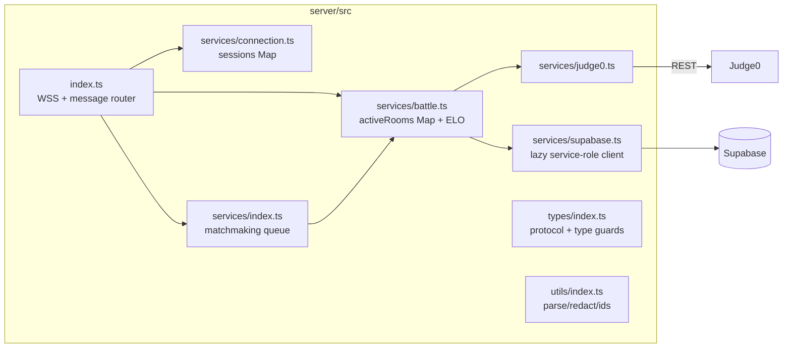

# Backend Overview — WebSocket Server

The backend for everything real-time is a **standalone Node.js WebSocket
server** in [`server/`](../../server) (TypeScript, `ws` package, run with
`tsx`; default port **8080**). It exists as a separate process because
matchmaking queues and battle rooms are long-lived, in-memory state that a
serverless Next.js deployment cannot hold.

The Next.js app also contributes two stateless API routes
(`/api/execute`, `/api/submit`) to the backend surface — documented in
[api.md](api.md).

## Responsibilities

1. **Connection management** — client sessions, heartbeats, stale-connection
   reaping ([services.md](services.md)).
2. **Matchmaking** — in-memory rating-range queue; pairs players and creates
   the battle in the DB ([services.md](services.md)).
3. **Battle rooms** — in-memory room registry keyed by `battles.id`,
   rebuildable from the DB; routes submissions, notifies opponents.
4. **Battle judging** — fetches private test cases (service-role), drives
   Judge0, persists submissions.
5. **Finalization** — on the first `ACCEPTED`: battle → `ENDED`,
   `finish_position` 1/2, ELO (K=32) profile updates, `ratings_history` rows.

## Architecture

## Request (message) lifecycle

`index.ts` is a single `connection` handler + message router:

1. On connect: `createClientSession(ws)` → assigns a `clientId`
   (`client_<ts>_<rand>`), stores the session, replies `connected`.
2. On message: `parseMessage` (Buffer/string → JSON object; malformed frames
   dropped silently), payload logged via `summarizePayload` (**source code
   redacted**, long strings truncated), then routed by type-guard:
   `join_queue` / `leave_queue` / `heartbeat` / `join_battle` /
   `battle_submit`. Missing-field messages are dropped with a warning.
3. Async handlers (`handleJoinBattle`, `handleBattleSubmit`,
   `createBattleAndNotify`) are fire-and-forget (`void …`) — the socket loop
   never blocks on Judge0 or the DB.
4. On close: `disconnectClient` (session map) then `cleanupOnDisconnect`
   (queue removal) — order documented in code.

A 30-second interval logs stats and `ws.terminate()`s sessions whose last
heartbeat is older than 60 s (termination triggers the normal close path).

## State model

| State | Where | Durability |
|---|---|---|
| Client sessions | `connectedClients: Map<clientId, ClientSession>` | volatile — connection-scoped |
| Matchmaking queue | `matchmakingQueue: QueuedUser[]` + `queuedUserIds: Set` | volatile — dropped on restart (clients rejoin) |
| Battle rooms | `activeRooms: Map<battleId, BattleRoom>` | **recoverable** — `rebuildRoomFromDb()` reconstructs a room from `battles` + `battle_participants` + `profiles` on demand |
| Battles, submissions, ratings | Supabase | durable source of truth |

This makes the server crash-tolerant for battles (a restart mid-battle loses
only who-is-connected, not the battle), but **single-instance by design** —
two server processes would have disjoint queues and rooms
([../deployment.md](../deployment.md)).

## Error handling & logging

- Every handler is wrapped in try/catch; failures send a typed `error`
  message (`{ message, code }`) to the affected client(s) — codes like
  `BATTLE_NOT_FOUND`, `NOT_PARTICIPANT`, `DUPLICATE_QUEUE`,
  `TESTCASE_LOAD_FAILED`, `SUBMIT_FAILED`.
- Logging is `console.*` with bracketed prefixes (`[Server]`, `[Matchmaking]`,
  `[Battle]`, `[Connection]`, `[Judge0]`, `[Stats]`) and per-submission
  prefixes `[Battle][battleId][userId]`. No log files or external sink.
- DB write failures during finalization are logged but not retried
  (see [../code-quality.md](../code-quality.md)).

## What the server does *not* do

- No HTTP endpoints, no middleware layer, no framework.
- **No authentication of WS messages** — it trusts the `userId` in payloads
  (flagged in [../security.md](../security.md)).
- No persistence of the queue, no cron/background jobs beyond the 30 s sweep.
