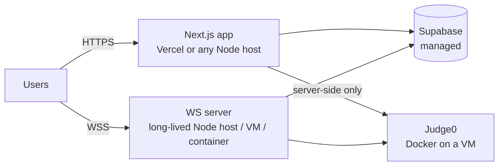

# Deployment

⚠ **There is no CI/CD, Dockerfile, or IaC in the repository.** This document
describes the deployment topology the code is *designed for* (inferred from
the architecture) plus the constraints you must respect. Anything not present
in the repo is marked as guidance.

## Target topology



| Component | Where | Why |
|---|---|---|
| `Frontend/` | Vercel (the code comments assume it) or any Node host | Stateless — pages + API routes |
| `server/` | Anything that keeps a process alive: VM, Railway/Render/Fly, ECS, systemd | Holds in-memory queue + rooms; **cannot** run serverless |
| Supabase | Managed cloud | — |
| Judge0 | Docker on a dedicated VM (`AWS_VM_URL` naming suggests AWS) | Runs untrusted code — isolate it network-wise; never expose it publicly beyond what the two app processes need |

## Production builds

```bash
# Frontend
cd Frontend && npm run build && npm run start     # or deploy to Vercel

# WS server
cd server && npm run build && npm run start       # node dist/index.js
```

Set env per [environment.md](environment.md). Production specifics:
- `NEXT_PUBLIC_WS_URL` must be `wss://` (TLS) — put the WS server behind a
  TLS-terminating proxy (nginx/Caddy/ALB). The `ws` server itself speaks
  plain WS.
- The frontend build **skips type-checking** (`ignoreBuildErrors: true`) —
  gate deploys on `npx tsc --noEmit` yourself.

## Reverse proxy (guidance)

For the WS server behind nginx:

```nginx
location / {
    proxy_pass http://127.0.0.1:8080;
    proxy_http_version 1.1;
    proxy_set_header Upgrade $http_upgrade;
    proxy_set_header Connection "upgrade";
    proxy_read_timeout 120s;   # > 30s heartbeat interval
}
```

Keep `proxy_read_timeout` comfortably above the 30 s client heartbeat so idle
sockets aren't cut.

## Database

No migrations exist — production schema must be created manually
([backend/database.md](backend/database.md)). Verify RLS policies before
going live: battle tables must have no public SELECT; private test cases must
not be readable with the anon key.

## Scaling considerations

- **The WS server is single-instance by design.** Queue and rooms are
  process-local; two instances = two disjoint matchmaking pools and rooms
  that can't see each other. Scale vertically first. Going multi-instance
  requires externalizing state (e.g. Redis) and/or sticky routing — a
  redesign, not a config change.
- A WS restart drops queue entries (clients auto-reconnect and can rejoin)
  but battles survive via DB rebuild.
- **Judging throughput** is the real bottleneck: sequential per-test-case
  sandbox spawns (~40–70 s for 51 cases). Scale Judge0 workers
  (`docker compose up -d --scale workers=N`) and adopt the batch API — full
  plan in [judging-performance.md](judging-performance.md).
- `/api/submit` on Vercel is subject to function timeouts — a slow judge run
  can exceed the default limit; the batch optimization also mitigates this.

## Deployment checklist

- [ ] Supabase: schema created, RLS verified, OAuth redirect URLs include the
      production `/auth/confirm`
- [ ] Judge0 reachable **only** from the two app processes (security group /
      firewall), not the public internet
- [ ] Both processes: same Supabase project, same Judge0 URL
- [ ] `NEXT_PUBLIC_WS_URL=wss://...`; WS proxy timeouts > 30 s
- [ ] `npx tsc --noEmit` clean in both packages
- [ ] Problems seeded (`npm run seed:problems`)
- [ ] Rate limiting in front of `/api/execute` and `/api/submit`
      (currently none — see [security.md](security.md))
